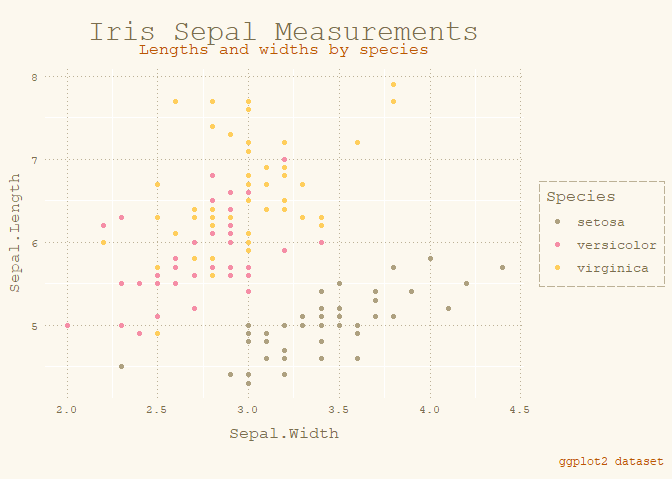
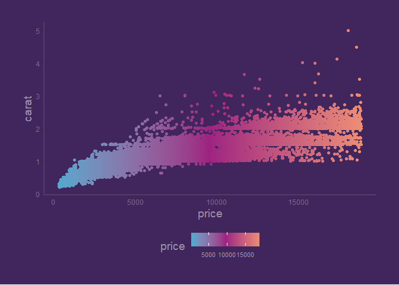

ggtea: palettes and themes for ggplot2
================

## Description

ggtea contains a collection of themes for usage with ggplot2. Each theme
comes with its own corresponding colour palette. Syntax follows the
viridis package.

Additionally, using a single function, one can apply the theme and its
corresponding palette to a plot.

## Install

Install the package via the official CRAN repository or via GitHub:

``` r
install.packages("devtools")
devtools::install_github("ambitiousbellydancingsquirrel/ggtea")
```

## Palettes

There are three themes: matcha, apricot and butterfly.

## Usage

``` r
... + theme_matcha()
... + theme_butterfly()

... + scale_color_apricot_d()
... + scale_fill_matcha_c()

#Quick apply
... + butterfly_c()
```

## Examples

``` r
  library(ggplot2)
  library(ggtea)

  ggplot(iris, aes(Sepal.Width, Sepal.Length)) + 
  geom_point(aes(col = Species)) + 
  labs(title = "Iris Sepal Measurements",
       subtitle = "Lengths and widths by species",
       caption = "ggplot2 dataset") +
  apricot_d()
```

<!-- -->

``` r
  ggplot(diamonds, aes(carat, price)) + 
  geom_point(aes(col = price), alpha = 0.25) + 
  labs(title = "Diamond Prices by Carat Size",
       subtitle = "How much does the carat size influence the price of a diamond?",
       caption = "Tinkerbell likes diamonds (I presume)") + 
  butterfly_c()
```

<!-- -->
